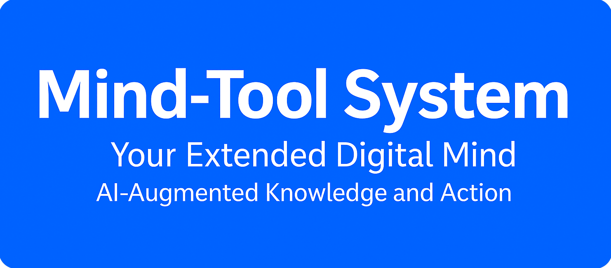

  

  
Mind-Tool System Your Extended Digital Mind Welcome to the Mind-Tool System, an AI‑augmented framework designed to function as an organized extension of your thinking. 📌 What This Site Provides 📘 Full System Overview 🧠 Architecture Diagrams 📂 Memory Folder Structure 🛠 Tools & Automation 🔒 Safety Principles 🚀 Getting Started Guide 👉 Jump directly to the documentation: Overview 🌟 What Is Mind-Tool? Mind-Tool is an AI‑powered personal automation system that: transforms your thoughts into structured knowledge keeps your digital world organized updates files and documentation intelligently evolves your projects over time acts safely through MCP tools Mind‑Tool behaves like an augmented digital mind—growing with you as you work. 🚀 Getting Started To begin using Mind‑Tool, clone the repository: git clone https://github.com/chrysochos/Mind-Tool-System.git Then connect with your AI tool and say: "Begin operating as Mind‑Tool. Create the Memory Folder and organize the project." The AI will automatically: create structure generate files maintain your Memory Folder evolve the project 📄 Documentation 📘 Full Overview 🧠 Memory Architecture 📂 Project Structure 🛠 MCP Tools 🔒 Safety Boundaries 📣 Credits Created by Dr. Ioannis Chrysochos. Mind‑Tool is designed for AI‑augmented thinking and digital clarity. 💡 Contribute Contributions are welcome: documentation diagrams examples improvements Extend the repository by adding files under docs/ or allowing the AI to expand the project autonomously. 